<!-- Please do not change this html logo with link -->

## IR communication using Core Independent Peripherals: IR Transmitter

## Introduction
  
Many real time control applications use infrared (commonly referred to as IR) wireless technology, as a communication mode. IR communication has the merits of consuming low power and is very cost effective.The IR communication is used in numerous control applications involving transmission of information and commands to control different house-hold appliances. Some commonly used home appliances which involve IR communication are the remote controls for television and air conditioners etc. There are various standard IR protocols in use such as S-link, RECS-80, RC-5, RC-6 and NEC. But the most commonly used protocol is NEC IR transmission protocol.

### To see the IR Communication transmitter and receiver demo operation video, click on the below image.

 

## Useful Links

- [PIC18F47Q10 Product Page](https://www.microchip.com/wwwproducts/en/PIC18F47Q10 "PIC18F47Q10 Product Page")
- [PIC18F47Q10 Code Examples on GitHub](https://github.com/microchip-pic-avr-examples?q=PIC18F47Q10&type=&language= "PIC18F47Q10 Code Examples on GitHub")
- [IR Communication using Core Independent peripherals:IR Receiver-GitHub link](https://github.com/microchip-pic-avr-examples/pic18f47q10-clc-ir-communication-receiver-mplab.git "IR Communication using Core Independent peripherals:IR Receiver-GitHub link")
- [DC Motor control with Touch Interface and IR communication-Application note](http://ww1.microchip.com/downloads/en/AppNotes/AN2933-DC-Motor-Control-with-Touch-Interface-and-IR00002933A.pdf "DC Motor control with Touch Interface and IR communication-Application note")

## IR communication demo application

This demo example explains how to implement IR communication seamlessly using Core Independent Peripherals (CIPs) of PIC18 Q10 microcontroller(MCU). In this demo, NEC Infrared transmission protocol is used for data encoding. The IR transmitter comprises of Configurable Logic Cells (CLCs), Pulse Width Modulator (PWM) and Data Signal Modulator (DSM) peripherals of PIC18 Q10 MCU, useful to prepare modulated data frame. The IR receiver comprises of Capture, Compare and PWM (CCP) module along with Timer 1 and Timer2(HLT) peripherals of PIC18F Q10 MCU, useful to decode the received data frame. The IR communication demo application consists of a transmitter and receiver units. These units are made up of Curiosity Nano Base for click boards from Microchip, IR Click and LCD mini click boards from MikroElekronika.

## IR Transmitter

The IR transmitter unit is realized using the existing evaluation boards; Curiosity Nano Base for click boards and PIC18F47Q10 Curiosity Nano board from Microchip and IR click board from MikroElekronika. The push button or switche S1 on PIC18F47Q10 Curiosity Nano board are used for generating commands. The switch press and release events are monitored using HLT modules of the MCU. The transmitter unit send a specific command to the receiver unit/board after each switch release event. If switch S1 is pressed, command is transmitted as switch press count i.e. from 1 to 8. After count 8 the commands are repeated i.e. command 1 to 8 for S1.

  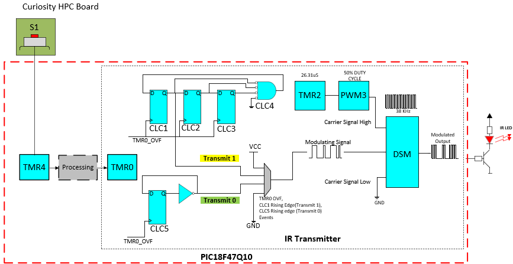
   Figure 1: IR Transmitter  

 

Following steps are followed for transmitting a command.

#### Event Detection:

* To detect the switch press and release event on pic18f47q10 curiosity nano board, and Timer 4 (for SW S1) are used and configured in monostable mode. Switches S1 is used as timer’s external reset source to start the timer. Upon Switch press or release event timers will start automatically. Timer’s period is set as 10 ms, to implement the switch de-bounce mechanism. The timer post-scaler is set as 1:2 to generate interrupt after switch press and release events

#### Command generation from switch press and release event:

* From the switch S1 press and release event, generate one byte of command to be transmitted (0x1 to 0x8).
* Reverse the bits in the command byte so that least significant bit (LSB) will be transmitted first as per NEC protocol.
* Take the address of the receiver (e.g. 0x00) and reverse the bits for transmitting LSB first.
* Generate a 32-bit data value (address, inverse of address, command, inverse of command) for transmission.

#### Transmit Command:

* Start Timer 0 which is configured to overflow every 4.5 ms.

#### Transmit Start:

* For the first overflow, set the DSM modulation source bit to high so that the 38 KHz PWM signal connected to carrier high of the DSM is output on Tx pin for start sequence of 9 ms. Timer 0 will overflow for two times so that the pulse burst of 38 KHz is transmitted for 9 ms (Mark from the start sequence).
* Set the DSM modulation source bit as low and wait for one more timer 0 overflow so that PWM with 0% duty equivalent to the logic 0 connected to carrier low of the DSM is transmitted for 4.5 ms (Space from the start sequence) which completes the start pulse.

#### Transmit 32-bit data(IR receiver address, inverse of address, command and inverse of command):

* After start pulse, change the timer period value to transmit 32-bit data at 562.5 µS period.
* Disable TMR0 interrupt. Further interrupts are handled in CLC ISR.

#### Generation and transmission of data bit as logic 1 or logic 0 using CLCs:

* Generate and transmit Logic ‘1’*: CLC1, CLC2, CLC3 and CLC4 are configured to transmit logic 1 as shown in figure 2.

  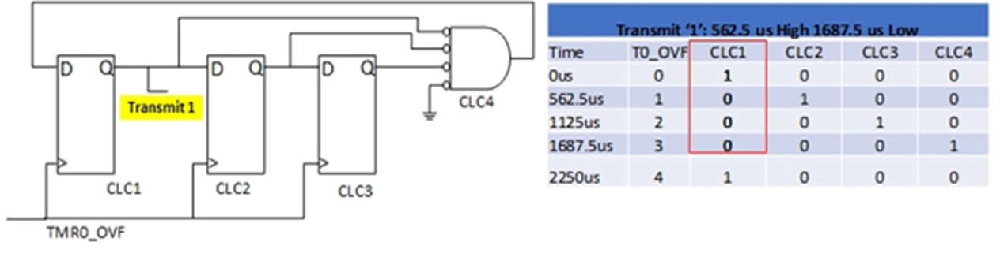
   Fig 2: CLC Configuration to Transmit '1'  

1. CLC1, CLC2 and CLC3 are configured as D flip-flops.
2. CLC4 is configured as an AND gate with four inputs.
3. Timer 0 overflow event is configured as a clock for the three D flip-flops.
4. Initially, output of CLC1 is set.
5. At the first Timer 0 overflow, the output of CLC1 (D flip-flop) becomes low and CLC2 output becomes high.
6. At the second Timer 0 overflow, the output of CLC1 and CLC2 D flip-flops becomes low and CLC3 output becomes high.
7. At the third Timer 0 overflow, the output of CLC1, CLC2 and CLC3 D flip-flops becomes low and CLC4 output becomes high. As seen in the table in the above figure, the output of CLC1 is ‘1,0,0,0’ i.e., 562.5 ìs high pulse and 1.6875 ms low pulse.
8. Output of CLC1 is connected to DSM modulating signal for transmission of logic ‘1’ data bit.
* Generate and transmit Logic ‘0’*: CLC 5 is configured to transmit logic 0 as shown in figure 3.

  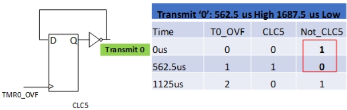
   Fig 3: CLC Configuration to Transmit '0'  

1. CLC5 is configured as D flip-flop and the output of CLC5 is negated.
2. Timer 0 overflow event is configured as clock for the D flip-flop.
3. Initially, output of CLC5 D flip-flop is low and the negated output of CLC5 is high.
4. At the first Timer 0 overflow, the output of CLC5 D flip-flop becomes high and the negated CLC5 output becomes low.
5. As seen in the table in the above figure, the negated output of CLC5 is '1,0' i.e. 562.5 ìs high pulse and 562.5 ìs low pulse.
6. Negated output of CLC5 is connected to DSM modulating signal for transmission of logic ‘0’ data bit. *Extract the first bit from 32-bit data value and transmit logic 1 or logic 0 accordingly.
* CLC rising edge interrupt is generated (CLC1 interrupt for logic 1 and CLC5 interrupt for logic 0).
* At CLC rising edge event, check if all the 32 bits are transmitted.
* If all bits are not transmitted, check if the next bit to be transmitted is logic 1/0.
1. Case 1: If logic 0 is transmitted before and the next bit is 0, don’t do anything, let the state machine transmit one more bit of logic 0.
2. Case 2: If logic 0 is transmitted before and the next bit is 1, disable CLCs for transmitting logic 0 and enable CLCs to transmit logic 1.
3. Case 3: If logic 1 is transmitted before and the next bit is 1, don’t do anything, let the state machine transmit one more bit of logic 1.
4. Case 4: If logic 1 is transmitted before and the next bit is 0, disable CLCs for transmitting logic 1 and enable CLCs to transmit logic 0.

#### Transmit End:

* If all the 32 bits are transmitted, enable the Timer 0 interrupt, make the DSM bit high for transmitting the stop bit.

#### Reinitialize for the next command transmission:

* Re-initialize the Timer 0 to 4.5 ms, enable Timer 4 and Timer 6 and wait for the next command to be transmitted.

#### Modulation:

The PWM3 peripheral along with Timer 2 is used for generating the 38 KHz carrier signal. Whenever the modulating signal is high, the 38 kHz output of the PWM3 module connected to the carrier high signal of a DSM is routed to the DSM output. Whenever the modulating signal is low, the carrier low signal of DSM module is routed to the DSM output. Since the PWM4 module is configured as 0% duty to give equivalent signal as ground, the carrier low signal generates logic low output. The modulated signal from the DSM module output is fed to the IR click’s IR LED for transmitting a command.  

## Software  Tools

- [MPLAB X IDE v5.40](https://www.microchip.com/mplab/mplab-x-ide "MPLAB X IDE v5.40")
- [XC8 Compiler v2.30](https://www.microchip.com/mplab/compilers "XC8 Compiler v2.20")
- [MPLAB Code Configurator v4.0.2](https://www.microchip.com/mplab/mplab-code-configurator "MPLAB Code Configurator v4.0.2")
- [PIC18F-Q_DFP v1.8.154](https://packs.download.microchip.com/ "PIC18F-Q_DFP v1.8.154")

***Note: For running the demo, the installed tool versions should be the same or later. This example is not tested with the previous versions.***

## Hardware used

- [PIC18F47Q10 Curiosity Nano](https://www.microchip.com/Developmenttools/ProductDetails/DM182029 "PIC18F47Q10 Curiosity Nano")
- [Curiosity Nano Base for Click boards](https://www.microchip.com/developmenttools/ProductDetails/AC164162 "Curiosity Nano Base for Click boards")
- [IR click]( https://www.mikroe.com/ir-click "IR click")
- [LCD mini click](https://www.mikroe.com/lcd-mini-click "LCD mini click")

## MCC settings

This section shows the settings used for the system clock and the peripheral configurations in the demo example. These settings were done using the MPLAB Code Configurator (MCC). Open MCC to look at the settings of the modules.

## MCC settings for IR Transmitter:

In the demo firmware the High-Frequency Internal Oscillator (HFINTOSC) is used to produce 32MHz system clock. System clock is configured as shown in figure 4 using system module.

## System Module

  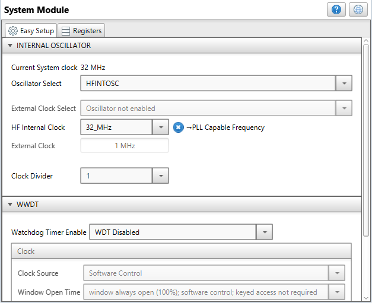
   Fig 4: System Clock Configuration  

## Timer 4 

Timer 4 is configured in monostable mode to detect switch press and release event of switche S1 respectively. Switch S1 is used as timer reset source to start the Timer 4 as shown in the figure 5.

  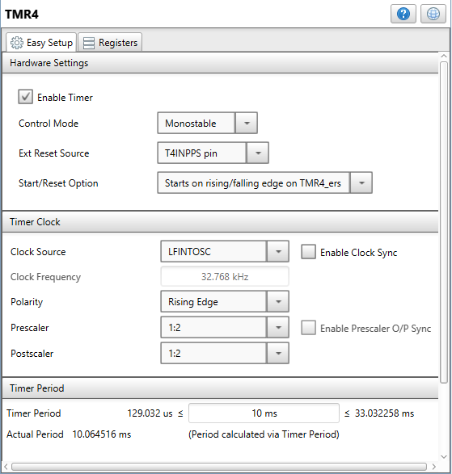
   Fig 5: Timer 4 configuration  

## CLC

CLC1, CLC2, CLC3 and CLC4 are configured together for generating and transmitting the IR data bit as logic 1. CLC5 is configured for generating and transmitting the IR data bit as logic 0. The CLCs are configured as shown in figures 6,7,8,9,10.

  
   Fig 6: CLC1 Configuration  

  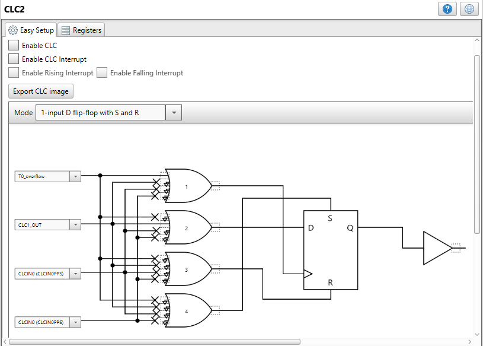
   Fig 7: CLC2 Configuration  

  
   Fig 8: CLC3 Configuration  

  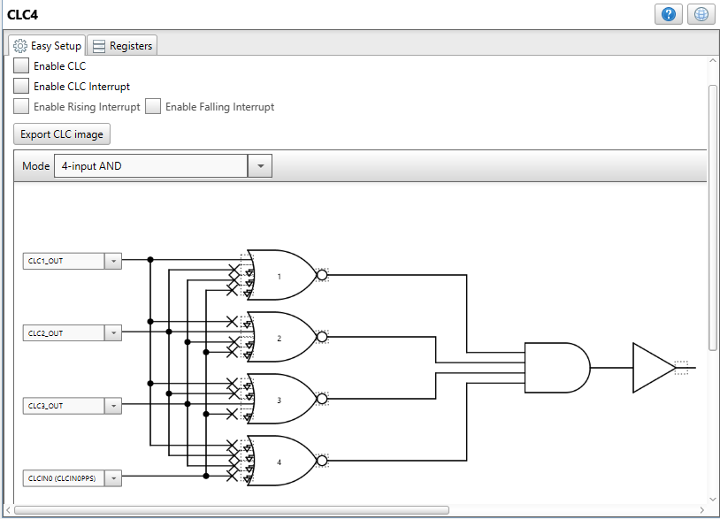
   Fig 9: CLC4 Configuration  

  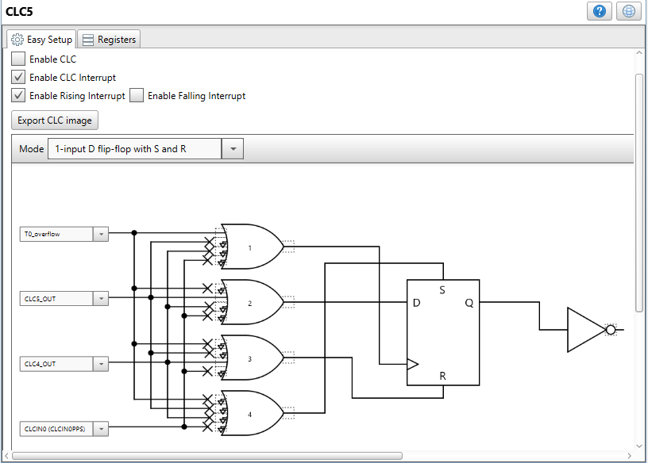
   Fig 10: CLC5 Configuration  

## Timer 2

The PWM3 peripheral along with the Timer 2 is used for generating 38 KHz carrier signal. The Timer 2 configuration in shown in figure 11.

  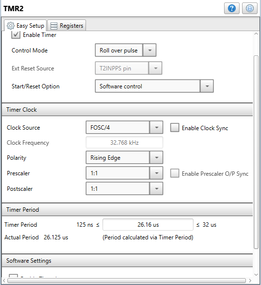
   Fig 6: CLC1 Configuration  

## PWM3 and PWM4

Configuration of PWM3 and PWM4 peripherals is shown in the below figure. Duty cycle of the PWM4 module is set to 0% and is fed to carrier low signal (CARL) of the DSM module to generate low signal at DSM output when the modulation source signal is in low state.

  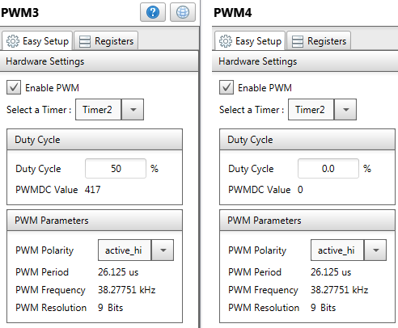
   Fig 12: PWM3, PWM4 Configuration  

## DSM

The DSM along with PWM3 and PWM4 modules generate the modulated data frame. The modulated waveform needs to be fed to the IR LED to transmit the data to the receiver board over the IR communication. The DSM module configuration is shown in the figure 13.

  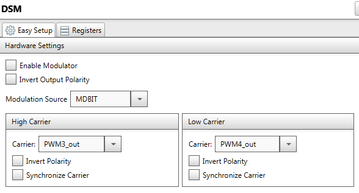
   Fig 13: DSM Configuration  

## Hardware setup

## IR Transmitter

* Connect IR Click board in mikroBUS™ slot 1 of the Curiosity Nano Base for click boards.
* Other port pins used in the application are discribed in the below table.

|Sr.No| MCU Port pin #|Signal Description|IN/OUT| 
|:---------:|:----------:|:----------:|:----------:|
| 1 | RA3 | DSM OUT Connected to IR LED on IR_CLICK with PWM pin| OUT |
| 2 | RE0 | LED on PIC18F47Q10 Curiosity Nano board | OUT |
| 3 | RE2 | Switch SW1 on PIC18F47Q10 Curiosity Nano board | OUT |
| 4 | RC5 | Timer 4 output pin is shorted to switch REO pin| OUT |

  
   Fig 14: Demo Set up Touch interface with IR TX  

* After making the hardware connections as shown in the above figure, power on the board with micro USB cable.Build demo firmware and load the generated hex file to the PIC18F47Q10 MCU.

## Demo operation

To complete the demo please visit IR Receiver xpress code example IR communication using Core Independent peripherals : IR Receiver.
